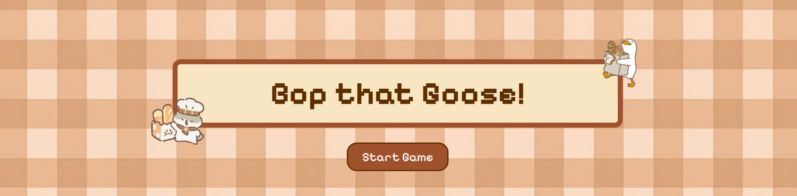
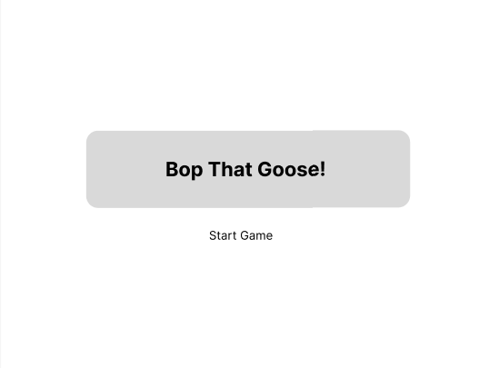
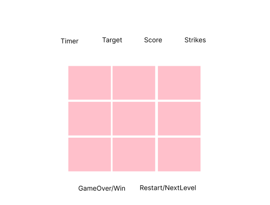

# Bop that Goose!
## Date: 01/09/2025
### By: Eman Qarooni
#### [LinkedIn](www.linkedin.com/in/eman-qarooni) | [GitHub](https://github.com/emanqarooni)
***

***
### ***Description***
##### A fun silly game that is inspired by whack-a-mole game and untitled goose game with the theme of baker the cat and goose, where the mischievous goose always try to steal the bread from the baker's cat, so it is the player's mission to stop that thieving goose by booping it away!.
***
### ***Technologies Used***
* Visual Studio
  * HTML
  * CSS
  * JavaScript
* Animate.css
* Figma

***
### ***Screenshots***
##### Figma link: [Figma](https://www.figma.com/design/jiI7PXerQ3rs0trE2KyXBk/BopTheCat?node-id=0-1&t=8LnQPqtUAwNjml4x-1)
###### Index Page:

###### Levels Page:

***
### ***Future Tasks***
- [] Add more levels.
- [] Fix the minor glitch issue with the hovering spatula.
- [] Add more sounds like mouse clicking sound effects when pressing on the start button.
***
### ***Credit***
##### Reference 1: [Reddit](https://www.reddit.com/r/learnjavascript/comments/ql9yes/how_to_set_up_a_timer_in_javascript/)
##### Reference 2: [W3Schools](https://www.w3schools.com/jsref/met_win_setinterval.asp)
##### Reference 3: [W3Schools](https://www.w3schools.com/js/js_timing.asp)
##### Reference 4: [Geeksforgeeks](https://www.geeksforgeeks.org/javascript/difference-between-addeventlistener-and-onclick-in-javascript/)
##### Reference 5: (mouseEvents) [W3Schools](https://www.w3schools.com/jsref/event_onmouseup.asp)
##### Reference 6: (mouseEvents) [Mdn](https://developer.mozilla.org/en-US/docs/Web/API/Element/mouseenter_event)
